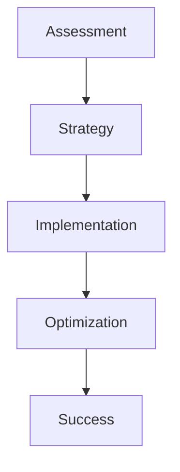

## Overview

Metis Tech Solutions delivers expert guidance in digital transformation and IT operations. You benefit from our team's proven track record in navigating complex tech landscapes, ensuring your business achieves scalable growth and operational efficiency. Our services focus on creating tailored roadmaps that align technology with your strategic goals.

<Callout kind="info">
  Partner with MTS to accelerate your digital journey. We specialize in end-to-end solutions that minimize disruptions while maximizing ROI.
</Callout>

## Core Services

Discover our primary offerings designed to propel your organization forward.

<Columns cols={3}>
  <Card title="Digital Transformation Roadmaps" icon="map" href="#digital-roadmaps">
    We craft comprehensive strategies to modernize your infrastructure, integrating cloud, AI, and automation for seamless evolution.
  </Card>
  <Card title="IT Operations Optimization" icon="settings" href="#it-optimization">
    Streamline your day-to-day operations with proactive monitoring, automation, and performance tuning to reduce costs by up to 40%.
  </Card>
  <Card title="Technology Advancement Consulting" icon="zap" href="#tech-consulting">
    Stay ahead with expert advice on emerging technologies, helping you evaluate and adopt innovations like edge computing and zero-trust security.
  </Card>
</Columns>

## Delivery Process

Follow our structured approach to ensure predictable outcomes.

<Steps>
  <Step title="Assessment" icon="search">
    We conduct a thorough audit of your current systems and processes.
  </Step>
  <Step title="Strategy Development" icon="file-text">
    Collaborate to define clear objectives and phased roadmaps.
  </Step>
  <Step title="Implementation" icon="rocket">
    Deploy solutions with minimal downtime, including training for your team.
  </Step>
  <Step title="Optimization & Support" icon="shield">
    Monitor performance and iterate for continuous improvement.
  </Step>
</Steps>



## Real-World Use Cases

See how MTS drives efficiency across industries.

<Tabs>
  <Tab title="Healthcare" icon="activity">
    A regional hospital reduced patient wait times by 30% through our IT optimization. We automated scheduling and integrated EHR systems.

    | Challenge | Solution | Outcome |
    |-----------|----------|---------|
    | Manual scheduling | AI-driven automation | 30% faster appointments |
    | Siloed data | Unified dashboard | Real-time insights |
  </Tab>
  <Tab title="Finance" icon="dollar-sign">
    A fintech firm adopted our digital roadmap, migrating to microservices on Kubernetes, cutting deployment times from days to minutes.

````yaml
# Example Kubernetes config for finance app
apiVersion: apps/v1
kind: Deployment
metadata:
  name: finance-app
spec:
  replicas: 3
  template:
    spec:
      containers:
      - name: app
        image: finance-app:latest
        resources:
          limits:
            cpu: "500m"
````

  </Tab>
  <Tab title="Manufacturing" icon="package">
    Optimized supply chain operations with IoT sensors and predictive analytics, achieving 25% inventory reduction.
  </Tab>
</Tabs>

<Expandable title="Detailed Case Study: Healthcare Transformation" default-open="false">

For a mid-sized clinic, we developed a digital roadmap starting with cloud migration.

<CodeGroup tabs="Terraform,Bash">
````terraform
# Infrastructure as Code for clinic migration
resource "aws_instance" "clinic_server" {
  ami           = "ami-0c02fb55956c7d316"
  instance_type = "t3.medium"
  tags = {
    Name = "ClinicAppServer"
  }
}
````
````bash
# Deployment script
#!/bin/bash
terraform apply -var="environment=prod"
kubectl rollout restart deployment/clinic-app
````
</CodeGroup>

This resulted in 99.9% uptime and scalable patient portals.

</Expandable>

## Get Started Today

Ready to transform your operations? Contact Metis Tech Solutions for a free consultation. Our experts will tailor a solution to your needs.

<Callout kind="tip">
  Schedule an initial assessment to uncover quick wins in your IT stack.
</Callout>